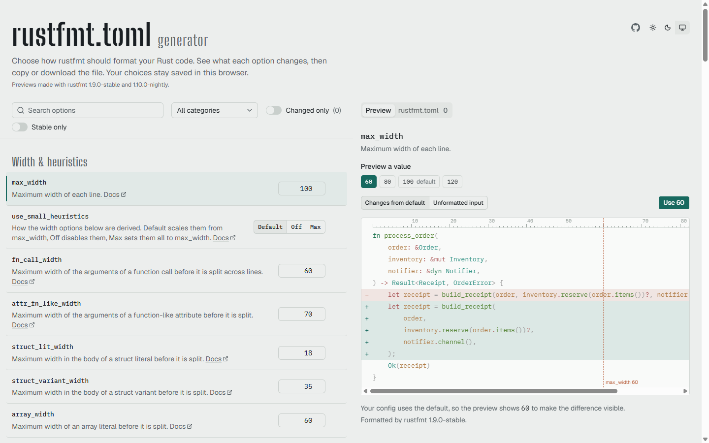

<div align="center">


# rustfmt.toml generator

**Create a Rust formatter configuration online, explore options with code previews, and download your `rustfmt.toml`.**

[](https://github.com/baliestri/rustfmt-generator/actions/workflows/deploy.yml)
[](https://rust-lang.github.io/rustfmt/)
[](https://nodejs.org)
[](LICENSE.md)

[**Open the generator**](https://baliestri.github.io/rustfmt-generator/) · [Quick start](#quick-start) · [Features](#features) · [How previews work](#how-previews-work) · [Development](#development) · [Releasing](#releasing)

</div>

Configure Rust formatting without editing TOML by hand. Browse stable and nightly options, compare precomputed before/after code samples, and export a configuration for `cargo fmt`. The generator runs in your browser, with no account or backend.

[](https://baliestri.github.io/rustfmt-generator/)

## Quick start

1. [Open the generator](https://baliestri.github.io/rustfmt-generator/).
2. Search for an option or browse by category. Enable **Stable only** if you use the stable toolchain.
3. Change options and inspect their sample diffs. Choosing a preview value only changes the preview; click **Use** to apply it to your configuration.
4. Open the **rustfmt.toml** tab, choose **Changed options**, and copy or download the file.
5. Save `rustfmt.toml` beside your project's `Cargo.toml`, then run:

```sh
cargo fmt
```

Already have a configuration? Use **Import** in the file tab to paste or upload it.

### Example configuration

This small configuration uses stable options:

```toml
max_width = 80
tab_spaces = 4
use_small_heuristics = "Max"
```

**Changed options** leaves out values matching the generator's defaults, so `tab_spaces = 4` is omitted unless you choose **All options**. The full export includes defaults but skips unchanged deprecated, version-pinning, and nightly-only keys.

To check formatting without rewriting files, use:

```sh
cargo fmt --check
```

> [!TIP]
> Options or values marked **nightly** require the nightly toolchain. Run `cargo +nightly fmt` to apply them. Exported lines that require nightly include a `# nightly` comment.

For configuration discovery and toolchain details, see the [official rustfmt guide](https://github.com/rust-lang/rustfmt#configuring-rustfmt) and [option reference](https://rust-lang.github.io/rustfmt/).

## Features

- **Searchable options.** Browse the rustfmt 1.9 configuration catalog plus nightly-only options, with typed controls, categories, and stable/changed filters.
- **Code previews.** Compare sample output against the default, with syntax highlighting, a column ruler, and a `max_width` guide.
- **Configuration checks.** Validate types and supported values, report invalid imports per key, and flag known conflicts between options.
- **Import and export.** Paste or upload an existing file; copy or download changed options or a fuller configuration with defaults.
- **Local persistence.** Configuration, filters, and theme are saved in your browser's local storage.
- **Responsive layout.** Use the generator on desktop or mobile, with light, dark, and system themes.

## How previews work

The site does not run rustfmt in your browser. It loads snapshots generated ahead of time with the real formatter:

1. [`scripts/preview-samples.ts`](scripts/preview-samples.ts) defines Rust samples chosen to demonstrate individual options.
2. `pnpm previews` runs [`scripts/generate-previews.ts`](scripts/generate-previews.ts), formats those samples, and writes [`src/data/previews.json`](src/data/previews.json).
3. The site displays a diff between the sample's default output and the selected snapshot.

Options requiring nightly, including options with nightly-only values, use the nightly toolchain for their snapshots. Other options use the configured stable toolchain. The generator stops on formatter failures or unexpected warnings, and reports samples with no visible change.

### Preview limitations

- Each preview demonstrates **one option in a fixed sample context**, not the combined effect of your complete configuration or your own source code.
- Numeric options have representative snapshots. If your value has no exact match, the preview shows the closest available value and labels that substitution.
- Options that only change how rustfmt runs have no visual preview.
- Your installed rustfmt version may produce different output. Run `cargo fmt` in your project to check the result with your toolchain.

> [!NOTE]
> Snapshots are committed to the repository. Rust is only needed to regenerate them, not to run or build the website.

## Development

**Prerequisites:** [Node.js 24](https://nodejs.org) and the [pnpm](https://pnpm.io) version pinned in `package.json`.

```sh
pnpm install --frozen-lockfile
pnpm dev
```

| Script              | What it does                                   |
| ------------------- | ---------------------------------------------- |
| `pnpm dev`          | Starts the dev server                          |
| `pnpm test`         | Runs the unit tests with Vitest                |
| `pnpm lint`         | Runs ESLint                                    |
| `pnpm format`       | Formats the code with Prettier                 |
| `pnpm build`        | Type-checks and builds to `dist/`              |
| `pnpm preview`      | Serves the production build locally            |
| `pnpm format:check` | Checks formatting without changing files       |
| `pnpm previews`     | Regenerates the preview snapshots with rustfmt |

The stack is React 19, TypeScript, Vite, Tailwind CSS v4 and shadcn/ui on Base UI. Code highlighting uses Shiki, and TOML parsing uses smol-toml.

### Regenerating previews

Install both toolchains with rustfmt, then run the script:

```sh
rustup toolchain install 1.98.1 nightly --component rustfmt
pnpm previews
```

To use other toolchains, set `RUSTFMT_STABLE` (default `1.98.1`) and `RUSTFMT_NIGHTLY` (default `nightly`).

### Upgrading rustfmt

1. Refresh the defaults fixture: `rustfmt --print-config default > scripts/fixtures/default-config.toml`.
2. Run `pnpm test`. It fails if an option was added, removed, or changed its default. Update [`src/lib/rustfmt/options.ts`](src/lib/rustfmt/options.ts) to match.
3. Add samples for any new options, then run `pnpm previews`.

## Releasing

Releases are cut from `develop` with the **Release** workflow. Run it from the Actions tab and enter a version such as `1.2.0`. The workflow:

1. Creates `release/v1.2.0+rustfmt.1.9.0` from `develop`, where `1.9.0` is the rustfmt version the previews were made with, and bumps `package.json` on that branch.
2. Merges the branch into `main` and tags the merge as `v1.2.0+rustfmt.1.9.0`.
3. Merges the branch back into `develop`, so the version bump isn't lost.

The tag push triggers the **Deploy** workflow, which lints, tests, builds and publishes the site to GitHub Pages under `/rustfmt-generator/`.

> [!IMPORTANT]
> Before the first release, set up the repository once:
>
> - **Pages:** in Settings → Pages, set the source to GitHub Actions.
> - **Tag deployments:** in Settings → Environments → `github-pages`, add the tag rule `v*`. Without it, deploys from tags are rejected.
> - **`RELEASE_TOKEN` secret:** a fine-grained personal access token for this repository with Contents: read and write. Pushes made with the default `GITHUB_TOKEN` don't trigger other workflows, so without this token the tag won't start the deploy. If `main` or `develop` are protected, the token's owner must be allowed to push to them.

## License

Released under the [MIT License](LICENSE.md). © 2026 Bruno Sales.

rustfmt is part of the Rust project and is dual-licensed under MIT and Apache-2.0. This site isn't affiliated with the Rust project. The preview snapshots contain rustfmt's output for sample code written for this repository.
